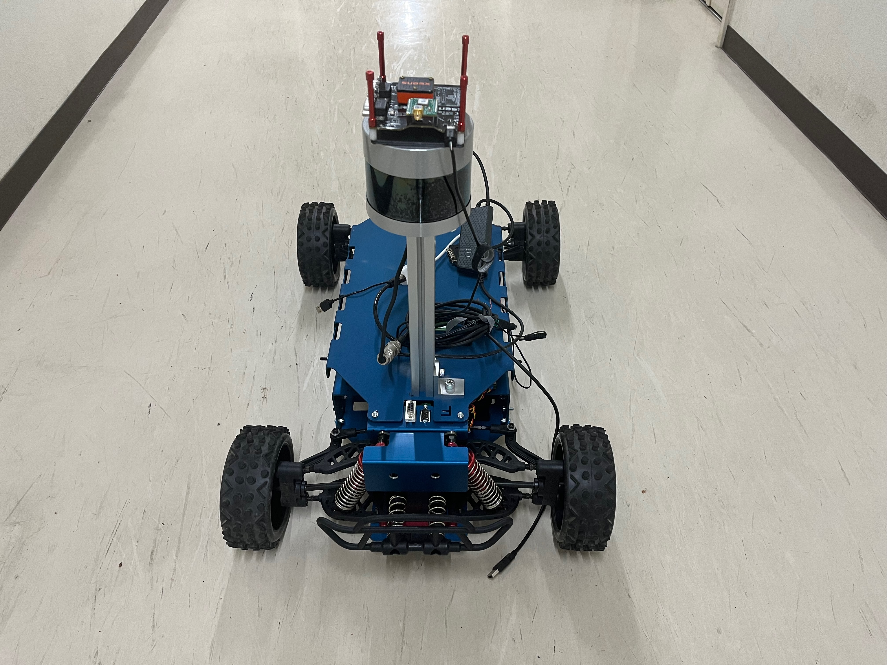
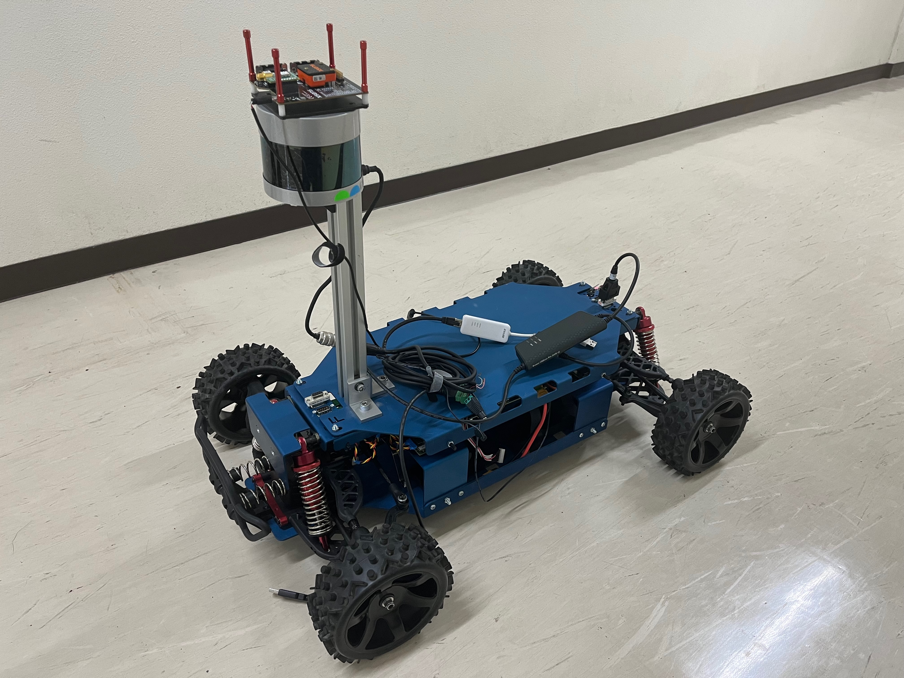

# Demo Rover
The Demo Rover is a high-performance RC car, created through the collaboration between two companies, Kvaser and CanEduDev.

  
  

## Features
### 1/5 Scale Size  

The Demo Rover is a 1/5 scale model of a real car. Its large size makes it perfect for outdoor driving and demonstrations, providing a visually impressive presence.

### Easy Hardware Mounting  

The vehicle is equipped with numerous mounting points, allowing for the easy attachment of various sensors, cameras, and other hardware. This makes it highly adaptable for research, development, and a wide range of projects.

### CAN Communication System  

The Demo Rover utilizes CAN (Controller Area Network) communication. This enables efficient and reliable data exchange between multiple electronic devices. 

### Powerful Performance  

The Demo Rover can reach speeds of up to 40 km/h. This high performance allows for extensive testing of high-speed driving and obstacle avoidance in large open areas.    

 If you need more detailed information, please refer to the page linked below.
[Demo Rover web page](https://www.canedudev.com/product/demo-rover/)

# Integrating Demo Rover and Autoware
[Integrating Demo Rover and Autoware](./docs/Integrate.md)
